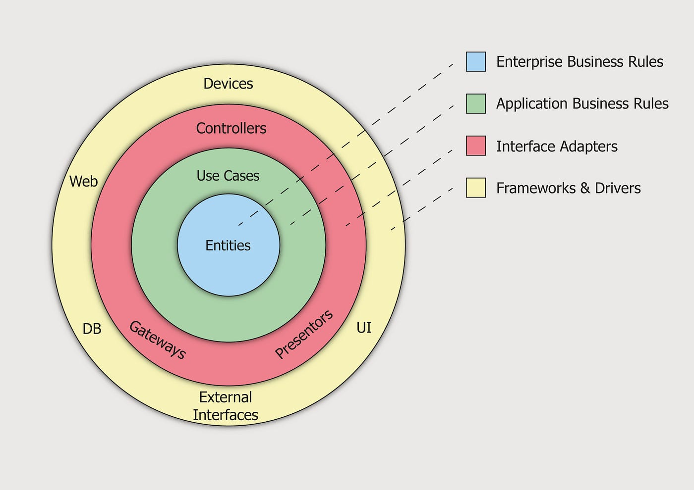
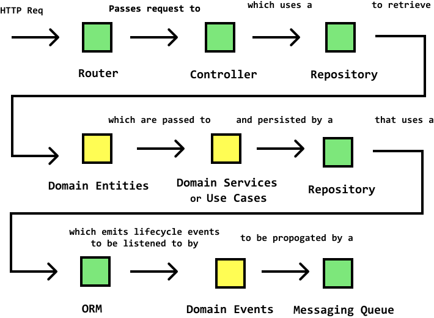

# clean-arch-nodejs

## Layers

### Drivers (Yellow layer)

- infrastructure layer, contains frameworks and drivers implementation
- it calls controllers that runs use cases
- 

### Adapters (Red layer)

- controllers layer, receives infrasture (port) calls and orchestrate use cases that executes business logic
- extract request params or event attributes
- compiles a structured response to return to external layers

### Application (Green layer)

- use cases layer, implement application business rules
- calls primitive methods inside the application core (entities and repositories)
- 

### Domain (Blue layer)

- entities layer, includes entities, repositories and core enterprise business rules
- only this layer will make DB queries or third parties to get data
- it also defines core pure functions that are responsible for implement business rules

## Example flow

